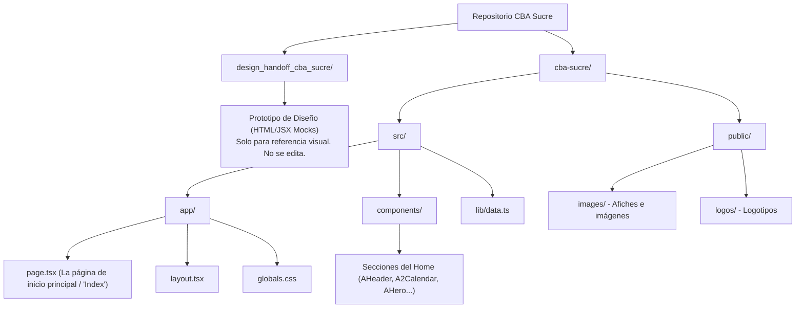

# CBA Sucre — Sitio Web y Referencias de Diseño

Este repositorio está organizado en dos partes principales para separar la **referencia del diseño original** de la **aplicación web real en producción**:

---

## 📂 Organización de Carpetas (¿Dónde está cada cosa?)



### 1. `design_handoff_cba_sucre/` (Solo Referencia de Diseño)
* **¿Qué es?** Es el prototipo interactivo en HTML/JSX entregado por el diseñador.
* **Archivos:** `CBA Sucre.html` (vista escritorio) y `CBA Sucre - Móvil.html`.
* **⚠️ Importante:** **No modificamos esta carpeta.** Solo sirve como guía visual para saber cómo debe lucir el sitio final.

### 2. `cba-sucre/` (La Aplicación Web Real - En Producción)
* **¿Qué es?** Es el código real del sitio web estructurado en **Next.js** y **React**.
* **¿Dónde está la página principal ('Index.html')?** 
  * En Next.js (App Router), no existen archivos `.html` estáticos. Las páginas se renderizan de forma dinámica desde React.
  * La página de inicio equivale a **[cba-sucre/src/app/page.tsx](file:///d:/TRABAJO/PROYECTO%20WEB/Proyectos/CBA/cba-sucre/src/app/page.tsx)**.
* **¿Dónde se edita el contenido de las secciones?**
  * Cada sección del sitio (ej. menú, hero, calendario, formulario) es un componente React ubicado en **[cba-sucre/src/components/](file:///d:/TRABAJO/PROYECTO%20WEB/Proyectos/CBA/cba-sucre/src/components)**.
* **¿Dónde están los datos de los cursos y horarios?**
  * Todo el texto dinámico y listado de horarios se encuentra centralizado en el archivo **[cba-sucre/src/lib/data.ts](file:///d:/TRABAJO/PROYECTO%20WEB/Proyectos/CBA/cba-sucre/src/lib/data.ts)** para facilitar su actualización.
* **¿Dónde se guardan las imágenes y logotipos?**
  * **[cba-sucre/public/images/](file:///d:/TRABAJO/PROYECTO%20WEB/Proyectos/CBA/cba-sucre/public/images)**: Afiche del calendario 2026 y banner promocional.
  * **[cba-sucre/public/logos/](file:///d:/TRABAJO/PROYECTO%20WEB/Proyectos/CBA/cba-sucre/public/logos)**: Espacio para logos (CBA, American Spaces, Embajada).

---

## 🚀 Cómo Iniciar y Ver el Sitio Web en tu Navegador

Para iniciar el sitio en tu computadora localmente y ver los cambios en tiempo real:

1. Abre tu terminal de comandos (PowerShell o Git Bash).
2. Entra a la carpeta de la aplicación web:
   ```bash
   cd cba-sucre
   ```
3. Ejecuta el servidor de desarrollo:
   ```bash
   npm run dev
   ```
4. Abre tu navegador e ingresa a: **[http://localhost:3000](http://localhost:3000)**.
   * Cualquier cambio que hagas en `page.tsx` o en los componentes se actualizará automáticamente en tu navegador.
